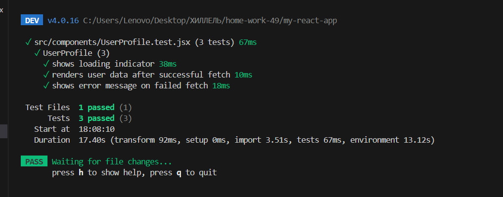

# Тестування асинхронної логіки React-компонентів

## Опис проєкту

Даний проєкт демонструє тестування асинхронної логіки в React-компоненті.

Компонент `UserProfile` виконує асинхронний GET-запит до API та відображає:

- індикатор завантаження під час виконання запиту
- дані користувача після успішного отримання відповіді
- повідомлення про помилку у разі невдалого запиту

## Встановлення проєкту

npm install

### Запуск проекту

npm run dev

### Запуск тестів

npm test

